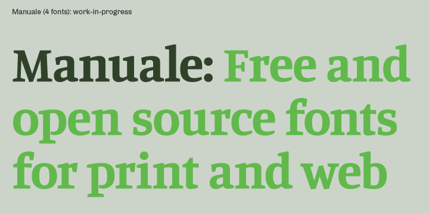

# Manuale family sources

**Omnibus-Type**  
*SIL Open Font License, 1.1*

To contribute to the project contact [Omnibus Type](http://omnibus-type.com/).

### Designers

* Pablo Cosgaya
* Eduardo Tunni

### License

Copyright (c) 2015-2016, Omnibus-Type (www.omnibus-type.com omnibus.type@gmail.com)

Licensed under the [*SIL Open Font License, 1.1*](http://scripts.sil.org/OFL); you may not use this file except in compliance with the License.

======
## FONTLOG for the Sources of Manuale fonts

This file provides detailed information on the Manuale font sources.  

**2016 July 26 (v0.075) compatible masters - Nicolás Silva Schwarzenberg**

- Sources with compatible paths
- New Medium weight
- New Semibold weight

**2016 June 4 (v0.074) Initial Commit - Nicolás Silva Schwarzenberg**

- Initial Commit

### Collaborators

If you make modifications be sure to add your name (N), email (E), web-address
(if you have one) (W) and description (D). This list is in alphabetical order.

**N:** **Nicolas Silva Schwarzenberg**  
**E:** nsilva.design@gmail.com  
**W:** http://www.omnibus-type.com  
**D:** Typeface development  

**N:** **Pablo Cosgaya**  
**E:** omnibus.type@gmail.com  
**W:** http://www.omnibus-type.com  
**D:** Designer

**N:** **Eduardo Tunni**  
**E:** omnibus.type@gmail.com  
**W:** http://www.omnibus-type.com  
**D:** Designer